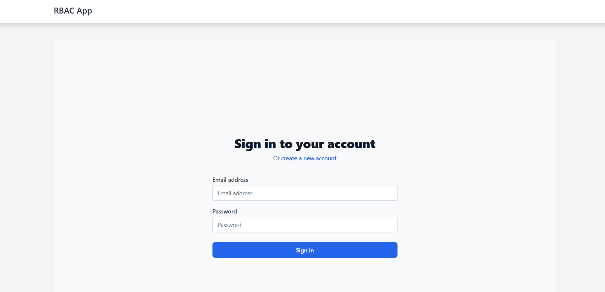
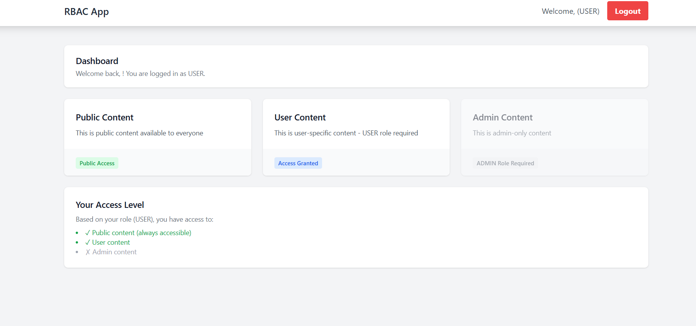
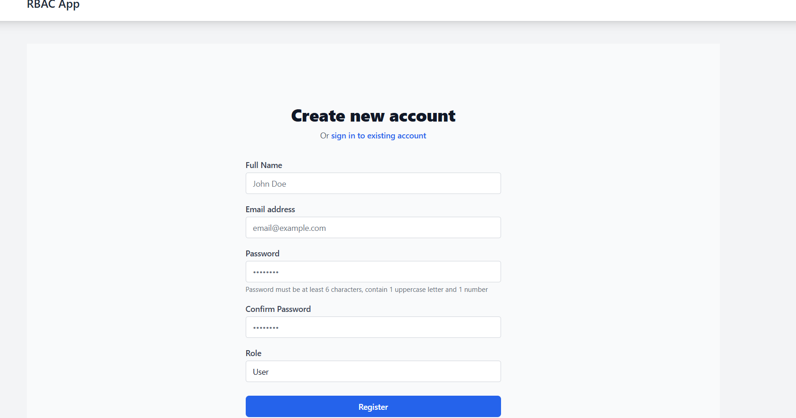

## 🔐 Role Based Authentication System
# JWT Authentication | Spring Boot | React | RBAC

A secure full-stack authentication system with JWT tokens and Role-Based Access Control (USER/ADMIN).
<br/>


---

<div align="center">
  
</div>

---

## 📸 Screenshots
### 🎓 Login Page


---
### 🛠️ Admin Dashboard

---
### 📝 RegisterPage

---

### ✨ Features
## 🔐 Authentication
User Registration (name, email, password, role)

Secure Login with JWT token

Password encryption (BCrypt)

Auto token attachment & logout

## 👥 Role Based Access
Role	Access
USER	Public + User content
ADMIN	Public + User + Admin content
🖥️ Backend
Spring Security + JWT Filter

Custom UserDetailsService

Java Records for DTOs

Swagger API docs

## 🎨 Frontend
React + TypeScript

Axios interceptors

Protected routes

Tailwind CSS

## 🛠️ Tech Stack
Backend

text
Java 17 | Spring Boot | Spring Security | JWT | JPA | MySQL | Maven
Frontend

text
React | TypeScript | Vite | React Router | Axios | Tailwind CSS
## 📁 Quick Structure
```text
backend/
├── config/         # Security & JWT
├── controller/     # REST APIs
├── service/        # Business logic
├── repository/     # Database
├── entity/         # User, Role
├── dto/            # Request/Response
└── security/       # JwtUtil

frontend/
├── api/           # Axios + interceptors
├── context/       # Auth context
├── pages/         # Login, Register, Dashboard
├── components/    # Layout, PrivateRoute
└── types/         # Interfaces
```

## 📡 API Endpoints
# Method	Endpoint	Role	Description
POST	/api/auth/register	Public	Register user
POST	/api/auth/login	Public	Login user
GET	/api/public	Public	Public content
GET	/api/user	USER/ADMIN	User content
GET	/api/admin	ADMIN	Admin content

## 🚀 Run Locally
# Prerequisites
Java 17, Node.js 18, MySQL 8, Maven

Backend
bash
git clone https://github.com/tiwarisaurabh786/Role-Based-Auth-System.git
cd backend

# Configure database in application.properties
```
spring.datasource.username=root
spring.datasource.password=yourpassword

mvn clean install
mvn spring-boot:run
# Runs on http://localhost:8080
Frontend
bash
cd frontend
npm install
echo "VITE_API_BASE_URL=http://localhost:8080/api" > .env
npm run dev
# Runs on http://localhost:3000
```

## 👨‍💻 Author
Saurabh Tiwari
📧 tiwarisoravvka@gmail.com
🔗 GitHub | LeetCode
